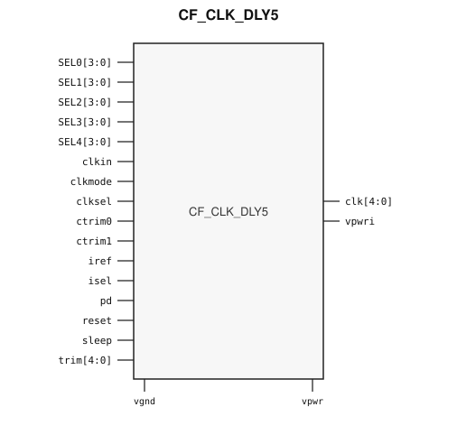

# CF_CLK_DLY5

> 5-tap clock delay line

The public GDS is an abstract; ChipFoundry
substitutes protected full geometry at tapeout.

This package ships an SRAM-style PG wrap `CF_CLK_DLY5` around analog leaf
`CF_CLK_DLY5_core`.

## Overview

`CF_CLK_DLY5` is a SkyWater 130 nm hard macro that delays an input clock
across eleven taps at ~1 ns spacing (~10 ns span, first tap ~2.5 ns) and
presents five independently selected outputs. Instantiate `CF_CLK_DLY5`.

Each output `clk[n]` picks a tap with `SEL0`–`SEL4`. `clksel` bypasses
`clkin` onto `clk[0]` when low. `clkmode` selects normal vs trim operation.
`ctrim0` / `ctrim1` and `trim[4:0]` adjust the delay bias. `isel` chooses
an external `iref` (~2.5 µA) or the internal current. `pd`, `sleep`, and
`reset` shut the line down.

Macro size is 91.345 × 286.43 µm (15 µm halo around analog leaf
61.345 × 256.43 µm). Customer PG for chip PDN is `vpwr` / `vgnd`. Analog
internal rail `vpwri` stays a wrap SIGNAL port so OpenLane can route it.
Well taps `vpb` / `vnb` are tied inside the wrap.

## Installation

```bash
pip install cf-ipm
ipm install CF_CLK_DLY5 --version 0.2.2
```

Use `hdl/gl/CF_CLK_DLY5.v` as the customer blackbox, `layout/lef/CF_CLK_DLY5.lef`
for P&R, and `layout/gds/CF_CLK_DLY5.gds` / `layout/mag/CF_CLK_DLY5.mag` for the
public wrap. `CF_CLK_DLY5_core` is the analog leaf (empty Verilog, pin-only
abstract). ChipFoundry substitutes vault GDS into `CF_CLK_DLY5_core` at tapeout.
P&R uses the wrap LEF (`vpwr` / `vgnd` for chip PDN).

## Features

- Five independently selected delayed clocks `clk[4:0]`
- Eleven taps; first tap ~2.5 ns, remaining taps ~1 ns (~10 ns span)
- Per-output 4-bit tap selects `SEL0`–`SEL4`
- `clksel` bypass of `clkin` onto `clk[0]`
- Coarse trim `ctrim0` / `ctrim1` and 5-bit fine `trim`
- External or internal bias (`isel` / `iref`)
- Power-down `pd`, sleep `sleep`, and active-high `reset`
- Customer cell `CF_CLK_DLY5` 91.345 × 286.43 µm (15 µm halo around analog leaf 61.345 × 256.43 µm)
- Chip PDN is `vpwr` / `vgnd`. Analog `vpwri` stays a wrap SIGNAL port.

## Pinout

Customer documentation includes a pinout of the integration cell only.
Internal schematics and architecture block diagrams are not published.



Pin names and directions match the public wrap (`layout/lef/CF_CLK_DLY5.lef`)
and the blackbox stub (`hdl/gl/CF_CLK_DLY5.v`).

## Pin Description

Directions and widths are taken from the shipped Verilog in `hdl/gl/CF_CLK_DLY5.v`.

| Name | Direction | Width | Description |
|---|---|---:|---|
| `clk` | output | 5 | Delayed clock outputs. |
| `SEL0` | input | 4 | Tap select for `clk[0]`. |
| `SEL1` | input | 4 | Tap select for `clk[1]`. |
| `SEL2` | input | 4 | Tap select for `clk[2]`. |
| `SEL3` | input | 4 | Tap select for `clk[3]`. |
| `SEL4` | input | 4 | Tap select for `clk[4]`. |
| `clkin` | input | 1 | Input clock. |
| `clkmode` | input | 1 | 0 = normal, 1 = trim mode. |
| `clksel` | input | 1 | 0 = bypass `clkin` to `clk[0]`, 1 = delay-line output. |
| `ctrim0` | input | 1 | Coarse delay trim bit 0. |
| `ctrim1` | input | 1 | Coarse delay trim bit 1. |
| `iref` | input | 1 | External ~2.5 µA bias current. |
| `isel` | input | 1 | 0 = use `iref`, 1 = use internal current. |
| `pd` | input | 1 | Power-down. |
| `reset` | input | 1 | Active-high reset. |
| `sleep` | input | 1 | Sleep. |
| `trim` | input | 5 | Fine bias adjustment. |
| `vpwri` | output | 1 | Internal analog rail (wrap SIGNAL, not chip PDN). |
| `vpwr` | input | 1 | Digital core supply (chip PDN). |
| `vgnd` | input | 1 | Digital core ground (chip PDN). |

`CF_CLK_DLY5_core` also has well taps `vpb` / `vnb`. The wrap ties
`.vpb(vpwr)` and `.vnb(vgnd)`. Do not connect those pins at chip level.

In OpenLane / LibreLane, hook chip PDN with
`PDN_MACRO_CONNECTIONS: "u_cf_clk_dly5 vccd1 vssd1 vpwr vgnd"` and connect
`.vpwr(vccd1)`, `.vgnd(vssd1)` under `USE_POWER_PINS`. Route `iref` / `vpwri`
to `analog_io` if used. Do not list the core well taps on the wrapper instance.

## Specifications

| Parameter | Typ | Unit | Conditions |
|---|---:|---|---|
| First tap delay | 2.5 | ns | nominal |
| Later tap spacing | 1 | ns | taps 1–10 |
| Span | ~10 | ns | eleven taps |
| Outputs | 5 | — | independently selected |
| Core supply | 1.8 | V | wrap `vpwr` / `vgnd` |

Public abstracts do not publish SPICE. Use `verify/beh_model/CF_CLK_DLY5_core.v`
for digital-timing bring-up.

## Timing Diagram

No customer timing diagram is published. Delay vs tap is monotonic in the
ideal model; characterized Liberty is in `timing/lib/`.

## Tapeout History

This hard macro has high-volume commercial production history (millions of
units). Catalog and IPM maturity is Production.

This ChipFoundry SkyWater 130 nm package delivers an abstract for
integration. ChipFoundry substitutes protected full layout at tapeout.
0.2.1 adds core `cmm1`/`cmm2` waffleDrop so fillgen does not overwrite
analog. LI fill-block remains `li1.blockage` 67/10.
0.2.2 publishes that wrap.
The chipIgnite delivery of this package is not marked shuttle-proven until
a run returns.

## Limitations and Open Issues

- Verilog in `hdl/gl/CF_CLK_DLY5.v` is a structural wrap around an empty
  `CF_CLK_DLY5_core` blackbox. Functional sim uses `verify/beh_model/CF_CLK_DLY5_core.v`.
- Companion delay-leaf / shifter / PSG cells stay foundry-only. This package
  ships the wrap around the public analog top.
